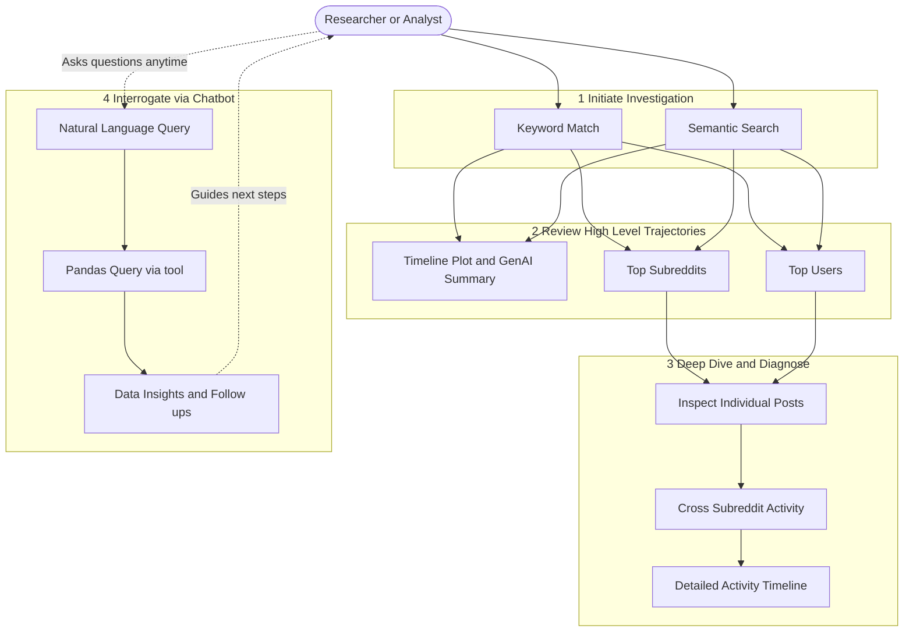

# Trace - Digital Narrative Analyzer

_A submission for the SimPPL Research Engineering Intern Assignment_

**Quick Links:**

- **Live Dashboard:** [http://simppl-frontend.s3-website-us-east-1.amazonaws.com/](http://simppl-frontend.s3-website-us-east-1.amazonaws.com/)
- **Video Walkthrough:** [YouTube](https://youtu.be/SP9SP2ljA0k?si=KE_33UK8Pv8g2Qz7)
- **AI Prompts Log:** [See `jainil-prompts.md`](./jainil-prompts.md)

---

## Dataset: Reddit Early 2026 Archive (Epstein Files Case Study)

This project serves as a case study on the release of the **"Epstein Files"**, analyzing thousands of real-world Reddit posts from **January and February 2026**.

- **Jan 2026 :** [RS_2026-01.zst](https://academictorrents.com/details/8412b89151101d88c915334c45d9c223169a1a60)
- **Feb 2026:** [RS_2026-02.zst](https://academictorrents.com/details/c5ba00048236b60f819dbf010e9034d24fc291fb)

---

## Overview

**Trace** is an interactive, full-stack intelligence dashboard designed to investigate the spread of digital narratives, analyze sociopolitical discourse, and track information across social networks. Built with a React/Vite frontend and a FastAPI/Python backend, it leverages LLMs, graph theory, and dense embeddings to uncover hidden patterns in social media data (Reddit submissions & comments).

## Key Features

1. **AI Chatbot & Tool Calling:** Query the dataset in plain English. The LLM acts as your guide to dataset, autonomously writing and executing Pandas queries to generate instant insights and suggest follow-up questions.
2. **Semantic Search via Embeddings:** Uncover a hidden footprint. Search the dataset using natural meaning instead of just keywords, returning contextually relevant posts even with zero keyword overlap.
3. **Network Visualizations:** Renders interactive user-interaction graphs to identify key contributors and echo chambers, dynamically calculating influence (Centrality Score).
4. **Time-Series Analysis with GenAI Summaries:** Tracks narrative volume over time, paired with dynamic, LLM-generated plain-language summaries tailored for non-technical audiences.
5. **Dynamic Topic Clustering & Map:** Groups posts into coherent clusters with a dynamically tunable parameter for the number of clusters. Includes a visual map of the high-dimensional embeddings.
6. **Automated Post Analysis:** Instantly processes individual posts using OpenAI NLP models to automatically extract the post's core narrative, perform sentiment analysis (positive/negative/neutral), and identify key entities mentioned.

---

## Screenshots
## Screenshots

### 🔹 Interactive Timeline & Trend Analysis


Explore how discussions evolve over time with an interactive timeline.  
Includes dynamic GenAI-generated summaries, highlighting top subreddits and key actors driving conversations.

---

### 🔹 AI Chatbot for Data Exploration


A natural language interface that allows users to query the dataset effortlessly.  
<br>

**Prompt:** `find me top 5 useres with "Auto" in name be case insensitive and find what percent of the post did the user with auto posted within these two months give me tables and percentage post.`

---

### 🔹 LLM Query Transparency


Inspect the exact Pandas queries generated and executed by the LLM. Enhances trust and debuggability by showing how answers are derived.

---

### 🔹 Automated NLP Analysis


Performs sentiment analysis, entity extraction, and narrative detection on posts. Helps uncover underlying themes and emotional trends in discussions.

---

### 🔹 Semantic Embedding Clusters


Visualizes high-dimensional embeddings projected into interpretable clusters. Allows dynamic exploration of thematic groupings within the dataset.

---

### 🔹 Network Graph & Community Detection


Interactive graph showcasing relationships between users and communities. Highlights influencer nodes, bot clusters, and structural patterns in the network.

---

## Key Insights (What I Found)

I used **Trace** as an analyst to investigate the January/February 2026 Reddit discourse around the Epstein Files. Here are the specific trends I discovered exploring the dataset:

1. **Event-Driven Spikes:** Through the **Time-Series tool**, I observed exceptionally high submission volumes converging around late January. This massive spike correlated directly with the U.S. Department of Justice releasing a major batch of over three million documents related to the Jeffrey Epstein investigation.

2. **Bot Network Detection:** While exploring the `Network Graph`, I noticed an isolated cluster: users with **"Auto"** in their names exclusively posting within subreddits that also featured **"auto"** in their titles. This visualization successfully flagged a distinct network of **automated bot** behavior separated from organic human discourse.

3. **Measuring Bot Activity:** I then used the **AI Chatbot** interface to dig deeper into this bot discovery. By prompting the chatbot to calculate the ratio of organic vs. bot posts using its tool-calling capabilities, it analyzed my subset of the data and revealed that approximately **7.9% of all submissions** were generated by bots.

_*Disclaimer: I **DO NOT** declare or claim that any specific user is a bot. Rather, these accounts exhibit highly automated activity patterns strongly suggestive of bot behavior as visualized and quantified by Trace.*_

---

## System Workflow



---

## 🧠 ML / AI Components

As required, here are the algorithmic and architectural details of the ML features implemented:
### 1. Generative AI & Tool-Calling Agents

* **Models:** `gpt-4o-mini`, `gpt-5-mini-2025-08-07`
* **Usage:**

  * **gpt-4o-mini** → GenAI summaries & bulk NLP (cheap + fast)
  * **gpt-5-mini** → AI chatbot, reasoning & tool-calling *(smart + still budget-friendly 😉)*
* **Stack:** `langchain-openai` for orchestration

### 2. Embeddings & Semantic Search

- **Model/Algorithm:** `all-MiniLM-L6-v2` (SentenceTransformers) / OpenAI `text-embedding-3-small` (dependant on pipeline config).
- **Key Parameters:** 384 embedding dimensions, Cosine Similarity distance metric.
- **Library/API:** `sentence-transformers`, `scikit-learn` for nearest neighbors, `FAISS` for vector indexing.

### 3. Topic Clustering

- **Model/Algorithm:** KMeans Clustering + UMAP for dimensionality reduction.
- **Key Parameters:** `n_clusters` (Tunable in UI via slider, default 10), UMAP `n_components=3` for visualization.
- **Library/API:** `scikit-learn` (KMeans), `umap-learn`, visualized via **Datamapplot** / **Plotly**.

### 4. Network / Centrality Analysis

- **Model/Algorithm:** PageRank and Louvain Community Detection.
- **Key Parameters:** Damping factor `d=0.85` (PageRank), resolution=1.0 (Louvain).
- **Library/API:** `NetworkX` (Python backend calculating edge weights based on interactions).

---

## Semantic Search Examples

Here are three examples of the semantic search successfully retrieving results with zero/minimal keyword overlap:

**Example 1: Political Cover-Ups**

- **Query:** _"Efforts by politicians to silence or threaten people involved with the unsealed documents"_
- **Result Returned:** "With millions of pages from the latest Epstein files now public and many redactions still unexplained, what do you think powerful people might be hiding in those undisclosed documents?"
- **Why it worked:** The search successfully connected the semantic concept of "politicians silencing people" to "powerful people hiding things in undisclosed documents," even without matching exact keywords.

**Example 2: Public Discourse and Suppression**

- **Query:** _"Coordinated campaigns or astroturfing to suppress the release of the flight logs"_
- **Result Returned:** "What’s your honest opinion on the Epstein flight logs being discussed again recently?"
- **Why it worked:** The model successfully matched the underlying thematic interest of the query (public discourse and suppression surrounding the flight logs) to a post generating discourse about the newly discussed logs.

**Example 3: Identifying Distraction Narratives**

- **Query:** _"Conspiracy theories regarding the timing of the file release"_
- **Result Returned:** "Epstein File is now a distraction: Anyone find the timing for the file release odd? For the past months this administration was doing everything to distract us..."
- **Why it worked:** The query’s focus on "conspiracy theories" and "timing" mapped perfectly to a user questioning the "odd timing" of the release as a deliberate political distraction.

---

## ☁️ AWS Deployment Architecture

- **Frontend:** `Amazon S3 Static Website Hosting`, globally accessible.
- **Backend:** Hosted on a powerful **AWS EC2 `m7i-flex.large`** instance to provide the necessary expanded RAM required for fast, in-memory Pandas dataframe processing.
- **Secrets Management:** The OpenAI API keys utilized by the system are securely managed in production using the **AWS Systems Manager (SSM) Parameter Store**, integrated with **KMS Encryption**.

---

## 🛠 Local Setup Instructions

### Prerequisites

- Python 3.10+
- Node.js v18+

### 1. Backend Setup

```bash
cd Backend
python -m venv venv
source venv/Scripts/activate  # On Windows use `venv\bin\activate`
pip install -r requirements.txt
python main.py
```

_The FastAPI server will start on `http://localhost:8000`._

### 2. Data Pipeline (Optional - for regenerating embeddings)

```bash
cd DataPipeline
python 1_filter_submissions.py
python 3_generate_dense_embeddings.py
```

### 3. Frontend Setup

```bash
cd Trace
npm install
npm run dev
```

_The Vite React app will be accessible at `http://localhost:5173`._

---
